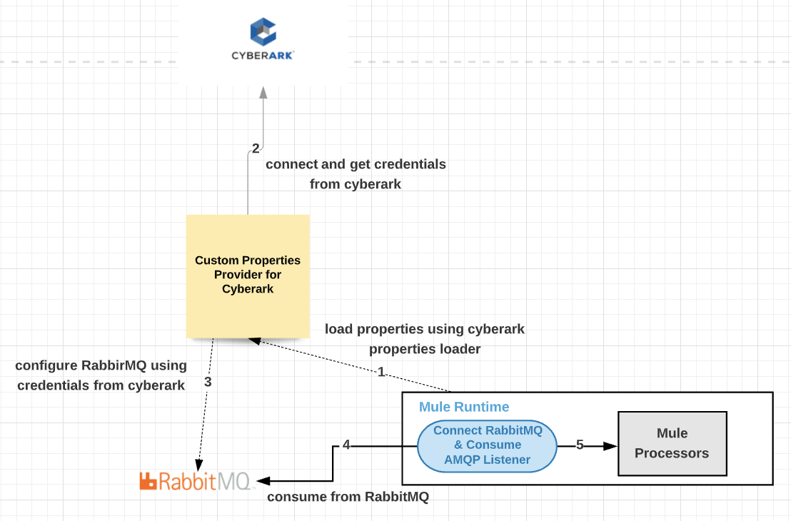
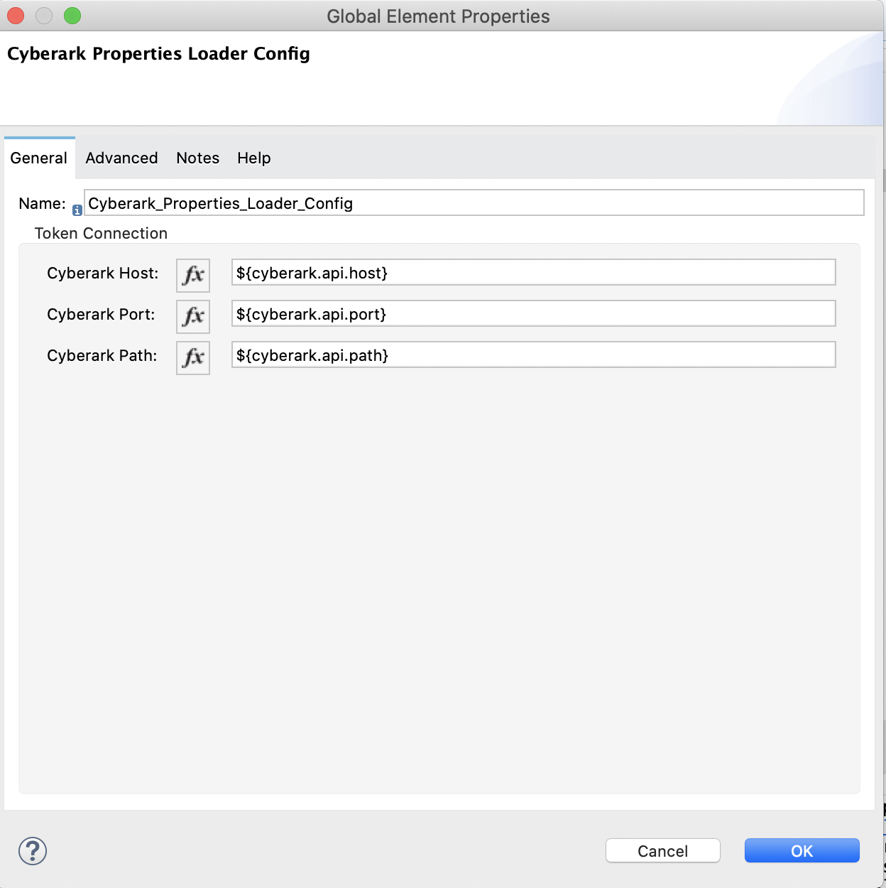

## Cyberark Custom Properties Loader for Mule 4
This module will be used to override properties during deployment (startup of Mule app). This will work in tandem with
properties placeholder
secure properties placeholder 



## Key Features
* Loads the properties at once during the app start up
* MQ Listeners needs the properties loaded during the app start up. 
* MQ Publishers and any other connectors doesn't need to fetch the properties on demand for every request
* Mule app doesn't to be restarted for every password change in the Cyberark. The connection to the MQ Provider is stateful
## Configuration
Download the project from “mulesoft-catalyst”.
Update pom.xml with your Organization Id

## Installation
## Local Install
For local install, give any groupId. Issue mvn clean install

## Exchange Install
Issue mvn deploy. Ensure that there is an entry in your settings.xml pertaining to Exchange2


## Using the module in a Mule4 Project
<dependency>
    <groupId>${groupId}</groupId>
    <artifactId>cyberark-custom-properties-loader</artifactId>
    <version>${version}</version>
    <classifier>mule-plugin</classifier>
</dependency>


## Configure the module


### Cyberark Host
The cyberark host e.g., ${cyberark.api.host}

### Cyberark Port
The cyberark api port e.g., ${cyberark.api.port}

### Cyberark Path
The relative api path e.g., ${cyberark.api.path}

### Example Config
<cyberark-properties-loader:config
		name="Cyberark_Properties_Loader_Config"
		doc:name="Cyberark Properties Loader Config"
		doc:id="8c479cc5-cfae-4d8f-ac7c-5e7142553414">
		<cyberark-properties-loader:token-connection
			cyberarkHost="${cyberark.api.host}"
			cyberarkPort="${cyberark.api.port}"
			cyberarkPath="${cyberark.api.path}" />
	</cyberark-properties-loader:config>



Configure the properties through Runtime Manager Properties
cyberark.api.host=https://api.cyberark.com/credentials
cyberark.api.port=5602
cyberark.api.path=/<system_user/*


### Usage

### Prefix
For all purposes, this module relies on cyberark as the prefix.
Any property provided as ${cyberark::} will be referenced from Cyberark.

Let’s say we need to configure the AMQP Connector with the credentials that needs to be retrieved from cyberark

Configure the AMQP Connector as
```
<amqp:config name="RabbitMQ_Config" doc:name="AMQP Config"
		doc:id="cc4287fd-a805-4426-879d-7663f73c9229" encoding="UTF-8"
		contentType="application/json">
		<amqp:connection host="${rabbitmq.host}"
			virtualHost="${rabbitmq.virtualhost}" username="${rabbitmq.username}"
			password='${cyberark::password}' port="${rabbitmq.port}">
			<reconnection>
				<reconnect frequency="5000" count="4" />
			</reconnection>
		</amqp:connection>
		<amqp:consumer-config ackMode="MANUAL" />
	</amqp:config>
```

### Limitations
* When the password is rotated in Cyberark, it will not be propagated until the mule app is restarted.
* This is not an issue for the AMQP Connector since it maintains the old connection even after the password is changed and is still active for performing any queue operations on the MQ Server.
* However, if there is a company policy to only utilize the latest password, then all the mule apps have to be restarted.


